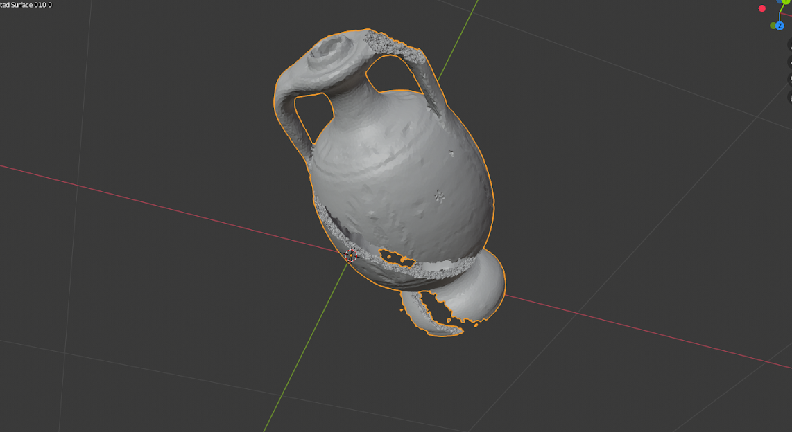

# Fracture Simulation



A GPU enabled fracture simulation of fragile objects. This is a small-side project which I started to teach myself a bit of CUDA programming and some principles of physics-based simulation (recently migrated from a GitLab).

### Literature

The approach used is exactly the one described in https://cal.cs.umbc.edu/Papers/Levine-2014-APP/, though to render the simulation data I used the approach described in https://jalevine.bitbucket.io/pubs/c/2015/12/18/extracting-surface-geometry.html. 

TL;DR: objects are modelled as special (peridynamic) particle-based systems, whose parameters - number of connections to the neighbors, elastic coefficient etc. - determine the properties of the material; the rendering is done offline using an approach based on marchine cubes. 

### System Requirements

For this project I used the CUDA toolkit 10.2. To make the simulation realistic you need million of particles and to run a simulation of that size you need a beefy GPU, or you have to be able to exploit your GPU resources smartly - which I didn't. I was lucky that I could use a tower pc in a lab at my university with a NVIDIA RTX GPU.

I started developing this on Ubuntu, but later switched to Windows. I used Visual Studio 2019 (though I think that 2017 should work fine as well) with CUDA support.

### Building the project

This project uses CMake and libigl, so the workflow to build the code is the usual.

Clone the repository:
```
git clone --recurse-submodules <url-of-the-project>

```
Create a build directory and configure the project using CMake:
```
mkdir build && cd build
cmake -DUSE_CUDA=ON ..
```
Then open the solution generated by CMake in Visual Studio and build the project in Release mode.

### Running the simulation

To start the simulation, simply run the compiled executable (the project has only one executable target). Make it run for a while and then stop it. A mesh file is used to load the models of the scene objects in the first place. 

### Post-processing

While the simulation runs, it also generates the simulation data which will be used for rendering. The simulation data is saved in file "temp.rec" in a custom format , which contains for each frame the necessary information about each particle (position, velocity, number of non-broken springs to neighbouring particles etc.).

The rendering is take care of by a python script ```extract_surface.py``` in the SurfaceExtraction folder.
To use this script you should have python3 and pycuda. To install pycuda on Windows I followed this: [link](https://www.ibm.com/developerworks/community/blogs/jfp/entry/Installing_PyCUDA_On_Anaconda_For_Windows?lang=en). The script generates a collection of ".stl", each representing the status of the object at a given frame. ".stl" files can be open in Blender.

The rendering script takes a mesh file and a simulation data file as input.

The mesh files used are also in a custom format ".mesh" which is an extension of the ".OFF" format: the rendering algorithm needs to know which tetrahedra in the original expose a face on the surface of the object, so for each tetrahedro this information is also reported in the mesh file.

To run the rendering script:

```
> cd SurfaceExtraction
/SurfaceExtraction > python extract_surface.py temp.rec -mesh_file a.mesh
```

### Future steps

As soon as I have time to get back to this, I would like to improve the code readability and reproducibility. Right now, I believe it would quite hard to reproduce the same results.

Furthermore, running this is on an average laptop is pretty much impossible. Most likely, by making a smarter use of GPU resources, the simulation could be done on a laptop GPU at the cost of higher run-times.


